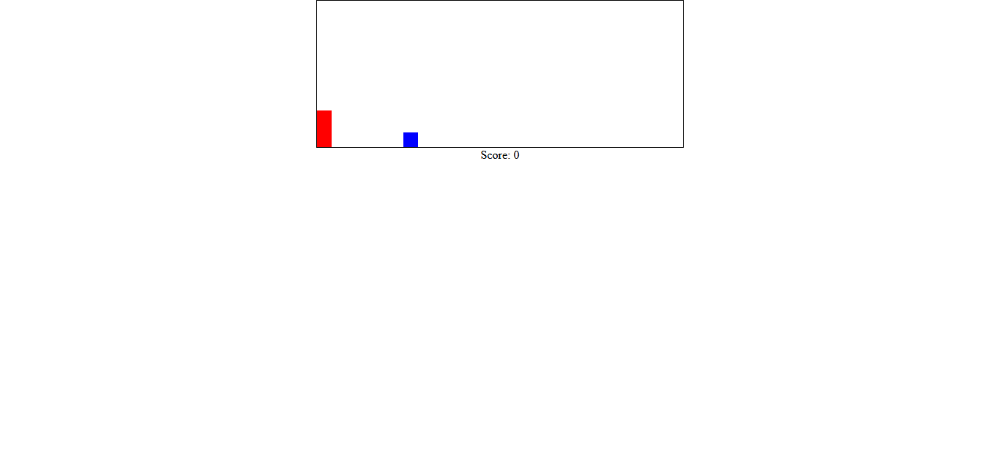

# Videogame Jump  

## trabajo realizado individualmente en el bootcamp 

### Proyecto:

 Se debe desarrollar un videojuego sencillo en el contexto de prácticas para el Bootcamp. 
 En este caso se desarrolla un juego con Html y CSS básicos en que la importancia recae en desarrollar el dinamismo del juego con JavaScript. 
 
### Cómo se juega:

Simplemente debes saltar el rectángulo rojo antes de que llegue el cuadrado azul. Siéste llega a tocar al rectángulo rojo la partida termina.

### Tecnologías aplicadas:

- Html
- CSS
- JavaScript

    
#### Link git pages:
https://sergiopons.github.io/videogamejump/

